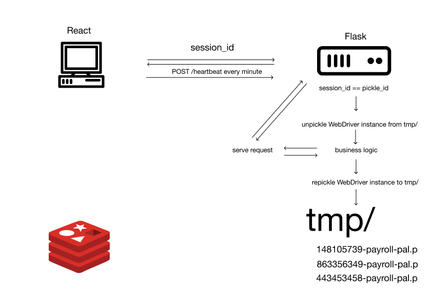
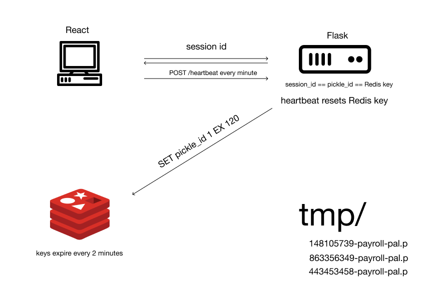
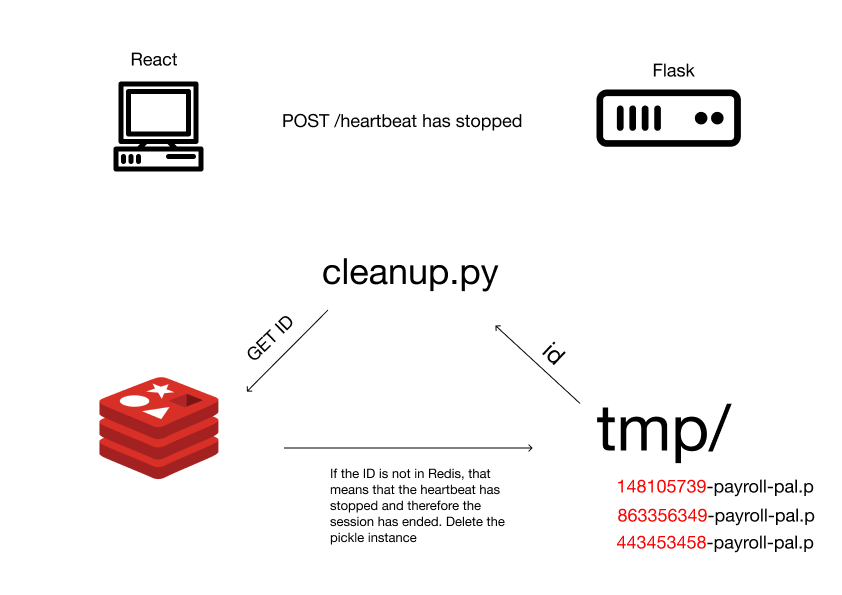

# Payroll Pal
[www.payrollpal.thefoundationworks.com](http://www.payrollpal.thefoundationworks.com)

Right when I moved into my new role, The Foundation Works had changed payroll providers and I have to be honest... It's hot trash. The web app sucks. The mobile site sucks. Hot. Trash.

I created this app as a way to pleasantly interface with this dumpster fire. Unfortunately, there is no API and it is a single page application so I knew I would have to do something that I don't really like doing... using Selenium WebDriver.

Selenium WebDriver is fantastic... for testing. But I have a history of building apps that need to use Selenium to power the business logic and it is always a pain in the neck.

Regardless, this app successfully interfaces with the payroll provider and let's me log my hours without ripping my hair out.

# The Tech

This app is built with a completely decoupled back and front end. The back end is built on **Flask** with **Selenium WebDriver** powering the business logic. It exposes an **API** for the **React** front end to securely consume. This was then served by **Gunicorn** and **Nginx**  on an Ubuntu server with the app processes managed by **systemd**.

## Managing Selenium WebDriver instances across requests
As I began implementing the back end, I realized that managing user sessions wasn't going to be a straightforward task. 

The solution I came up involved scrapping the built in Flask session. The session now consists of an `id` that references a pickled Selenium WebDriver instance. This is encoded in the `Authorization` token. The instance is pickled so that the state within the instance is persisted across requests.

As a result, every request requires the pickled object to be loaded and then the business logic can be performed.

However, I needed a way to manage the pickled objects once the session had ended. Otherwise I would end up with a bunch of pickle files bloating the system.

I ended up adding a heartbeat and a **Redis** store to the application. Now whenever a WebDriver instance is created, the `id` is set in Redis with an expiration of 2 minutes. The heartbeat on the front end pings the back end every minute, signalling that the session is still active. Every time the back end is pinged, the `id` in Redis is reset to expire in 2 minutes. Now, as long as the user is using the app, the instance is kept alive.

Now I just needed a way to clean up the pickle files when the sessions *do* expire. This ended up being a simple cron job that runs `pickle_cleanup.py` every 5 minutes. This script gathers all of the `id's` of the pickled objects and checks if they are present in the Redis store. If they are present, that means the heartbeat is active and therefore the session is active. If they are not present, that means the heartbeat has stopped and the instance can be destroyed.

